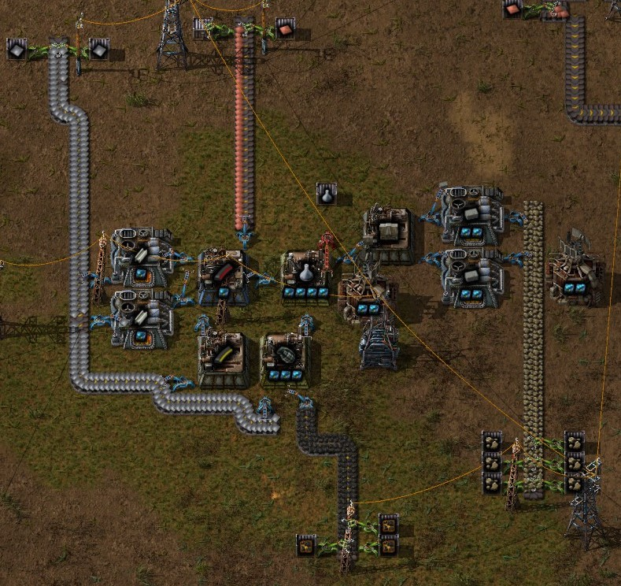
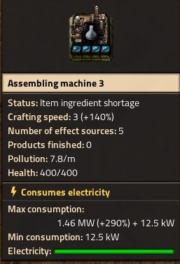
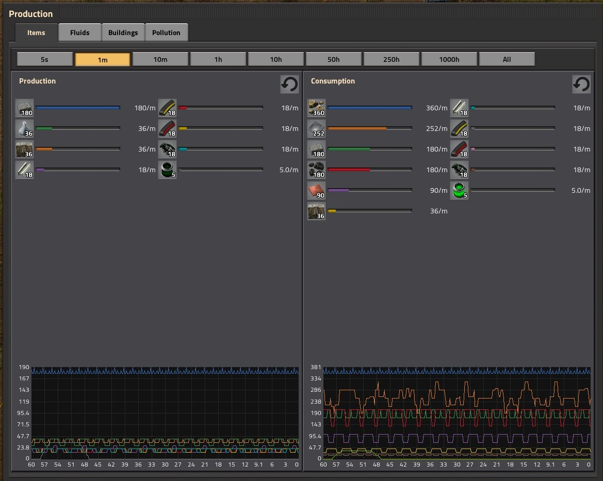

# Factorio Crafting Guide

This is a simple tool to help in designing optimal assembly lines in [Factorio](https://factorio.com/),
based on the desired output.

See it running here: [https://davidrios.github.io/factorio-craft-guide/](https://davidrios.github.io/factorio-craft-guide/)

## Usage

Lets say I want to produce 36 [military science packs](https://wiki.factorio.com/Military_science_pack) per minute. I open the tool and fill in the fields, then I will be presented with a table like this: [see table](https://raw.githubusercontent.com/davidrios/factorio-craft-guide/master/docs/table1.png).

The columns "craft time", "craft qty" and "craft /s" are the base values for the item.

"Needed qty" specifies how many of that material you'll need to craft the needed quantity all the way to the root. For instance, 2 military science packs need 1 piercing round magazine, which in turn need 1 steel plate, which need 5 iron plates and so on.

"Needed /s" and "Needed /m" shows the amount of that material you'll need per second and per minute to meet the desired output. For the example above, you'll need to produce 18 steel plates per minute.

The items needed are separated by individual recipes, but at the end of the table you'll see an aggregated by material list. For the example above, according to the table you'll need to produce a total of 252 iron plates per minute.

The last column, "Needed crafting speed", is related to the crafting speed number show in-game, and you'll need the sum of the crafting speed of your assembly line to match the number. For instance, for a 3.0 crafting speed need, you could have 6 of assembly machine 1, which have 0.5 base crafting speed each, so 6 * 0.5 = 3.0.

I have built a compact line to output the example above in the game:

Blueprint:

    0eNqdmt9yqzYQxl8lw7U5g/4ictvH6JzpYKw4TAEzgNummbx7RYzBp17Dfr7KxDY/rXb3W60kPqN9dfZtVzZD9PoZlcWp6aPX3z+jvjw2eTV+Nny0PnqNysHX0S5q8nr8L+97X++rsjnGdV68l42PVfS1i8rm4P+JXsXXbhNRl1U55N1H3Belbwoft3nx5w1Dfv3cRb4ZyqH0F5u+//n4oznXe9+FQWZUP3hfxcW774fAb099eObUjCMHTiz0LvoY/8qv0az/UeQNJRgQl03vuyF8Q4DUDNpFh7LzxeVbS2DVjB26vOnbUzfEe1+R9kkaqwmsBqwVNFYSWMN1ZbLmSjtT9uUx9lUYsSuLuD1VnmDZH2aCiR+GwqVMo64YRUEc32F65mxGN+NHV9FUKrijd1EsI2fEjVDqvKo2IyPXgiwkN1fWwiIUPy6S9iCVx0KDU51FIkgrzRMqFoyIWDzQCQObAuZOE88YWIdjHQOb4c7NtlNA4iJi+EAKmMpwgZS4Zy0Dq3BsysBq2AccqoGpHBdY3AWagX1CYYaBdbAPOFR8lWK4QCW8+j/PnmKItUZS3MOmpXlcAYJxZXsZ/RR+/Heo8hE1xCKtt7wfVtYXS06dKi1q0dW8rryduyYviKXFLdix7+3Hj/vW+0Ncnw7nysdyHIQaRXMtv3ZjHNP5KlvkQHGe0BWjRVFP6IrRUCkHBCx2i7lkxMZtDTVItpbMcqXRvM3mtvRdMT7Ync7NoQ/PH/N/AyDCjNEJN3liS0aH6na1YEPVNTYURq5vH+9oCeEnetf42Em7O9HRti3Srk7Bqvc8bEIPa9pjJ6Fm61mSEaHkrA1eiQRcibQFayjH8hStbhyog6sbPeEM5pDZZBYV7n1ehIfun1dbUVEPomIEXCsZewfzRCvK2OmYRVe1P5TnentHlkwmUzS2lJaTiu3yZgy+SghwkTAWrMsJw262lOYtNAPqNlNXzQZi5cTA6iKTwCawSMmQWFxHjE7G4jpiyMgqNPEZobYa7MKnxuWXLvwtjJF39dKvUAMZtvWG7RGLFhY9oSlYCnYm0+HWL544dr7JDysNm7zvRWhrHNddCdtbi/T6874f8u+f3it7OpKVDw5kYeWRdSAVKIZ0U4orjdGtpfjZCWP7lQJHJ5OAOVTg6CRjQ4EdnmNDgf1dSkHJUDlwTdXbNTGF1yj61gFWCrnbdgJ1m9mOhQN0Y9hQQDaWDQVUo9lQ+LzRMqDwgT7j/M4BopFsSx3YNHIMzbAFi4HM+AJKpqlTFHiloTESNCYlKXyJiImyfQ/JV4hkMw3IdORsLe+YOFtxWIogaCvggwEak7FvK6fV2237WSTwIkG6SSSCb52krCNvUhOJUlMOVTFvD9TahDUEcTQETXOR0Bwo0TOakYKbmesm74FJDk3XjJOucGtET1YkaGIxbn2FEFBOPDANyPlLABin50Iwcz65IkkI/80fRZpGe82gVMGhWlRa9NsXwPsMctV3jhcAvQrJIAg9o5uXExivSInrfvzRG1Li5rUEXuGY/BQ2LT8v5xSjJfMbgLuoyoN/w2e/dfnb8KLsy/W+5WW8Z+lfWt+Fj5rzMLL/8l3/jU5VIjIrhUpD//QfPiBUAA==

Showing the crafting speed of the main assembly machine:

And the output shown in-game:

